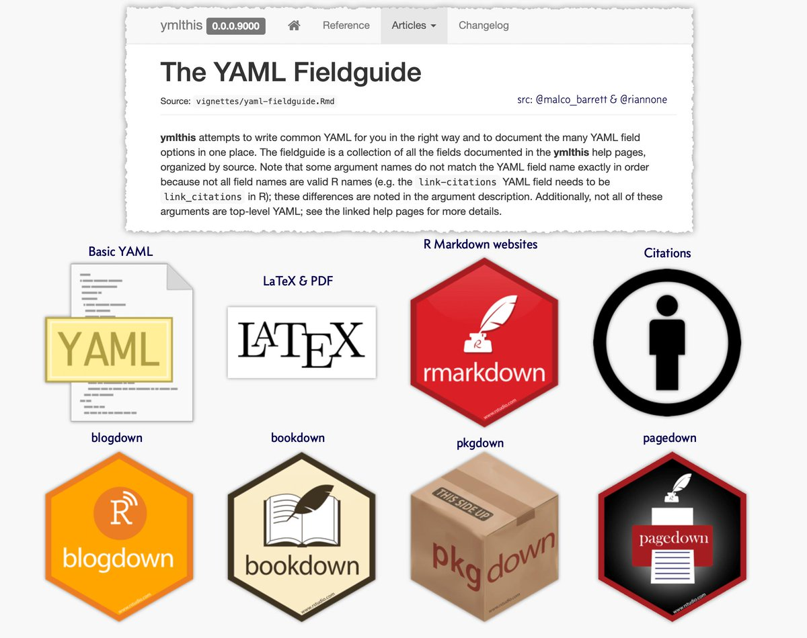

class: inverse, center, middle

```{r setup, echo=FALSE}
options(htmltools.dir.version = FALSE)
htmltools::includeCSS("https://raw.githubusercontent.com/malcolmbarrett/kakashi/master/kakashi.css")
```

# **Writing YAML with ymlthis**

---

## write YAML with R code

```{r ymlthis_output, eval=FALSE}
library(ymlthis)
header <- yml() %>% 
  yml_output(pdf_document(), html_document()) %>% 
  yml_latex_opts(fontsize = "12pt")

header
```

---

## write YAML with R code

```{r, ref.label="ymlthis_output"}
```

---

```{r, echo=FALSE, out.width="60%", out.height="60%"}
knitr::include_graphics("https://i.imgur.com/BkzGueG.gif")
```

---
## write YAML in your teaching materials

```{r asis_output, eval=FALSE}
header %>% 
  asis_yaml_output() #<<
```

---

## write YAML in your teaching materials

```{r, ref.label="asis_output"}
```

---

## write YAML in your teaching materials

```{r knit_print, eval=FALSE}
knit_print.yml <- function(x, ...) { #<<
  ymlthis::asis_yaml_output(x)
}

header #<<
```

---

## write YAML in your teaching materials

```{r, ref.label="knit_print"}
```

---

class: inverse, center, middle

# **Drawing the hierarchy in a YAML header**

---

# Whitespace is syntax in YAML

```{r nesting_ex, eval = FALSE}
yml() %>% 
  yml_output(
    html_document(toc = TRUE, toc_float = TRUE),
    pdf_document()
  )
```

---

# Whitespace is syntax in YAML


```{r, ref.label="nesting_ex"}
```

---

# Drawing YAML hierarchy

```{r}
draw_yml_tree() # draws the most recent YAML by default
```

---

# Understanding whitespace errors

```yaml
---
output:
    html_document:
    toc: true
toc_float: true
---
```

--


```{r echo=FALSE, highlight.output = 2:4}
"output:
    html_document:
    toc: true
toc_float: true" %>% 
  as_yml() %>% 
  draw_yml_tree()
```

---

class: inverse, center, middle

# **[The YAML Fieldguide](https://ymlthis.r-lib.org/articles/yaml-fieldguide.html)**

---

```{r, echo=FALSE, out.width="85%", out.height="85%"}

```

.pull-right[Image by @dataandme]

---

class: inverse, center, middle

# Learn More

# [An Introduction to ymlthis](https://ymlthis.r-lib.org/articles/introduction-to-ymlthis.html)
# [YAML: an Overview](https://ymlthis.r-lib.org/articles/yaml-overview.html)
# [The YAML Fieldguide](https://ymlthis.r-lib.org/articles/yaml-fieldguide.html)

---

class: inverse, center, middle


### `r icon::fa("github")` [malcolmbarrett](https://github.com/malcolmbarrett/)
### `r icon::fa("twitter")` [@malco_barrett](https://twitter.com/malco_barrett)
### `r icon::fa("link")` [malco.io](https://malco.io)

Slides created via the R package [xaringan](https://github.com/yihui/xaringan).
